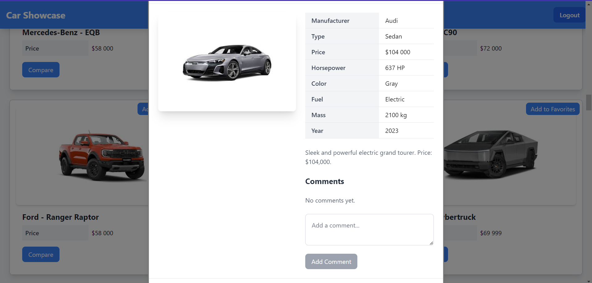

# Car Showcase User Guide

Welcome to the Car Showcase, a platform for browsing and managing cars. This guide walks you through key features with step-by-step instructions and screenshots.
- **Open this with Markdown Preview Enhanced VsCode Extension**

## Table of Contents

1. [Getting Started](#getting-started)
2. [Browsing Cars](#browsing-cars)
3. [Managing Favorites](#managing-favorites)
4. [Comparing Cars](#comparing-cars)
5. [Admin Dashboard](#admin-dashboard)
6. [Troubleshooting](#troubleshooting)

## Getting Started

1. **Visit the Site**
   - Open your browser and go to `http://localhost:5173` (or the deployed URL).
   - 

2. **Register or Log In**
   - Click “Register” to create an account or “Login” to sign in.
   - For testing, use:
     - Email: `Teszt123@Teszt.com`
     - Password: `1234Asdf###`
      
   -  

## Browsing Cars

1. **Access the Car Catalog**
   - Click “Cars” in the navigation bar.
   - View a grid of cars with details like price, horsepower, and year.
      - 

2. **Search and Filter**
   - Use the search bar to find cars by name.
   - Apply filters (e.g., price range, manufacturer) to narrow down results.
   - 

3. **Sort Cars**
   - Select a sort option (e.g., Price, Year) and choose ascending/descending order.

## Managing Favorites

1. **Add to Favorites**
   - Log in, then click “Add to Favorites” on a car card.
   - A confirmation message appears.

2. **View Favorites**
   - Go to “Profile” to see your favorite cars.
   - Remove cars by clicking “Remove from Favorites”.
   - 

## Comparing Cars

1. **Select Cars**
   - Click the compare button on two car cards.
   - A modal opens showing a side-by-side comparison.

2. **Review Details**
   - Compare price, horsepower, fuel type, and more.
   - Click “Close” to exit.
   - 

## Admin Dashboard

*For admin users only.*

1. **Access the Dashboard**
   - Log in as an admin (requires `ADMIN` role).
   - Click “Admin” in the navigation bar.
   - Admin Password: SuperSecretAdminPassword123!

2. **Manage Cars**
   - Add new cars using the form.
   - View and delete cars from the list.
    - 

3. **Manage Comments**
   - View comments for each car.
   - 

## Troubleshooting

- **Can’t log in?** Check your email/password or register a new account.
- **Cars not loading?** Ensure the backend server is running.
- **Contact support**: Email `info@carshowcase.com`.

---
